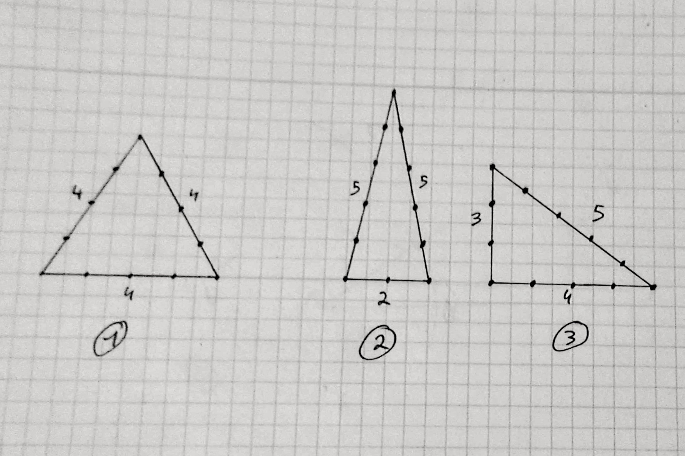
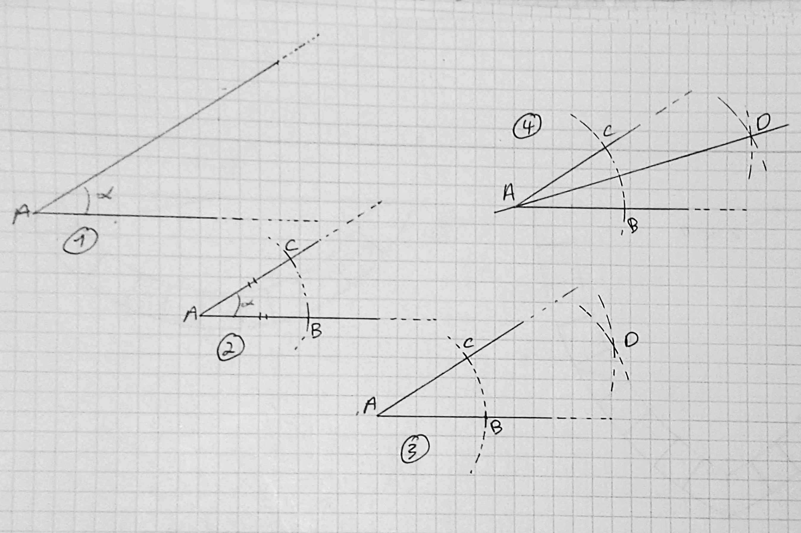
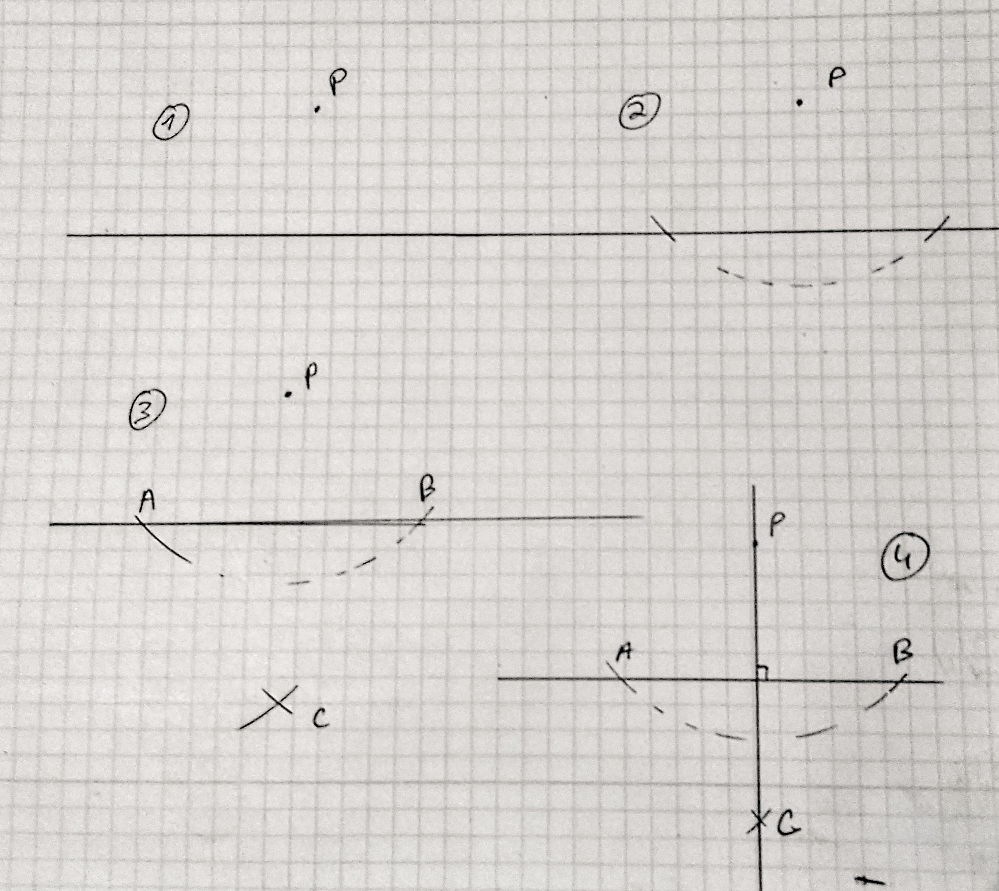
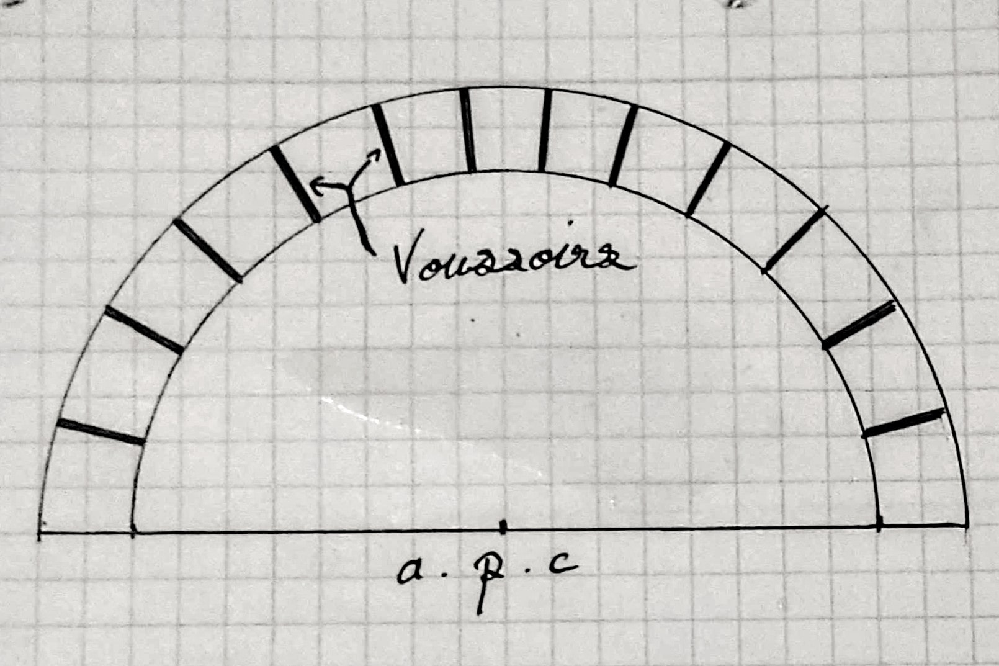
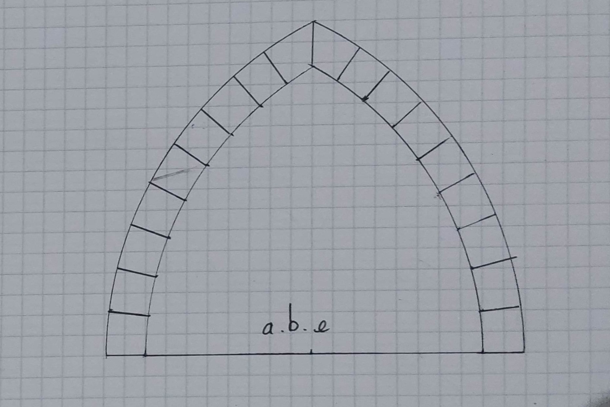
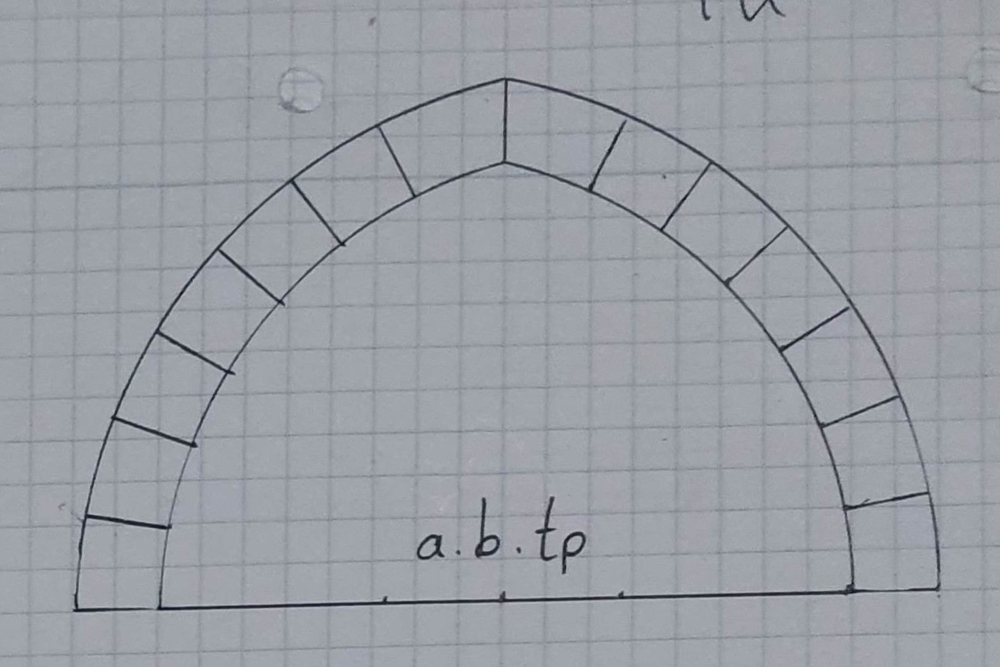
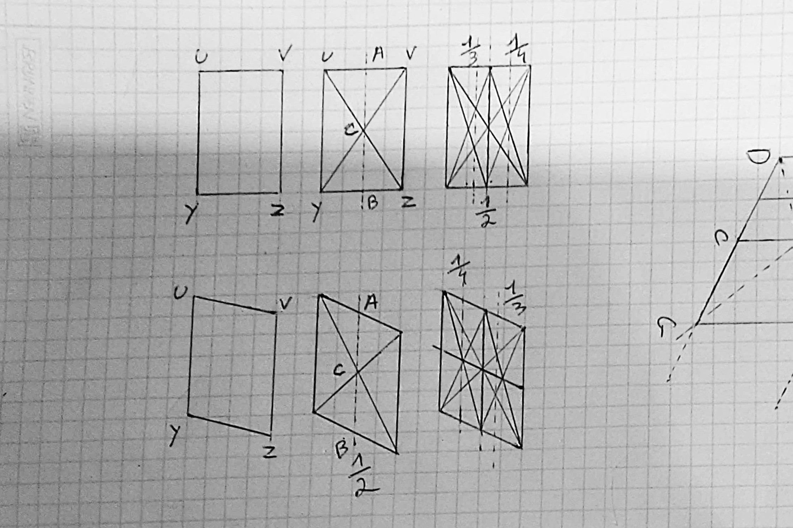
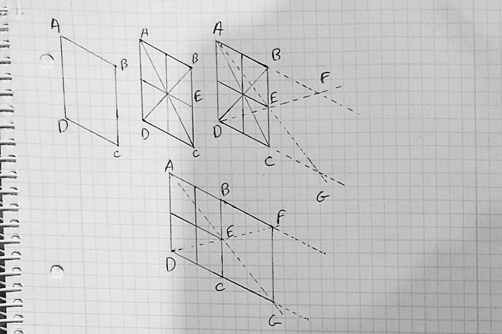

> [Accueil](../../) > [Portail technique](../) > [Portail construction](./) > Corde et cordes à treize noeuds

## Corde et cordes à treize noeuds

Corde avec 13 nœuds mais surtout 12 segments utiliser depuis des millénaires sur les chantiers pour mesurer, calculer des angles et faires des calculs de bases comme l'addition et la soustractions ainsi que la multiplication et la division.

> Multiplier vient de plier plusieurs fois la corde pour effectuer l'opération
### Géométrie par piquetage

#### Parallélogramme, rectangles et carrés
On peut créer des parallélogramme avec une corde à treize noeuds comme les suivants:

1. Carré: 3, 3, 3, 3 
2. Rectangle: 2, 4, 2, 4
3. Rectangle 1, 5, 1, 5
4. Losange (3, 3, 3, 3)
#### Triangles et angles
On peut réaliser différents triangles avec la corde à treize noeuds avec lesquels ont peut mesurer des angles.

1. Triangle équilatéral (4, 4, 4) avec des angles de **60 degrés** 
2. Triangle isocèle (5, 5, 2) avec des angles d'environ 78,5 degrés et environ 23 degrés (la majorité des clochers d'Europe sont des triangles (5, 5, 2)) 
3. Triangle rectangle (3, 4, 5) permettant de **mesurer un angle droit** et deux autre angles respectivement d'environ 37 et 53 degrés 

### Fil comme compas

#### Bissectrice 
Une Bissectrice est une droite qui sépare un angle en deux partie égale. Dans le cas d'un segment elle sépare le segment en deux et est perpendiculaire à ce segment (l'équivalent d'une Bissectrice de 180 degrés). Construction:

1. Nous voulons construire la bissectrice de l'angle  
2. Plaçons le compas en A et construisons C et B assurant [AC]=[AB]
3. Construisons D en plaçant le compas en C et B, et en maintenant un écart identique assurant que [CD]=[BD]
4. Traçons la bissectrice (DA)
#### Perpendiculaire à un segment par un point pas sur la ligne

1. Nous avons un point P que nous souhaitons projeter de manière orthogonale sur le segment ou trait. Autrement dit nous souhaitons construire une perpendiculaire au trait en passant par P
2. Commençons par construire A et B en plaçant le compas en P avec un écartement strictement supérieur à la distance entre P et notre trait (distance la plus petite). 
3. Construisons C en ce plaçant respectivement en A et B et en maintenant un écartement identique assurant [AC]=[BC]. L'écartement doit être strictement supérieur à la distance [AB]
4. Traçons la perpendiculaire passant par P en traçant (PC)
#### Ellipse

#### Arc en plein cintre

#### Arc surbaissé 

#### Arc brisée équilatéral 

#### Arc brisée en tiers point

### Division de parallélogramme 
Grâce au piquetage nous pouvons également diviser des parallélogramme de manière extrêmement précise.

1. Prennons le parallélogramme UVZY
2. Construisons son centre C en traçant UZ et VY
2. (bis) La parallèle à UY et VZ passant par C divise en deux UVZY et permet de construire A et B
3. En traçant UB et YA on obtient 3 nouveaux points dont un, l'intersection de ces derniers tracée, définissant un quart de AB et YZ mais centré sur UY et VZ. Les deux autres points sont situé à différents tiers. 
### Multiplication de parallélogramme 

1. Prennons un parallélogramme ABCD
2. Divisons le pour obtenir le centres et le point milieu E de BC
3. Construisons F en prolongeant DE et AB. Construisons G de façon similaire en prolongeant AE et DC.
4. BFGC est identique à ABCD